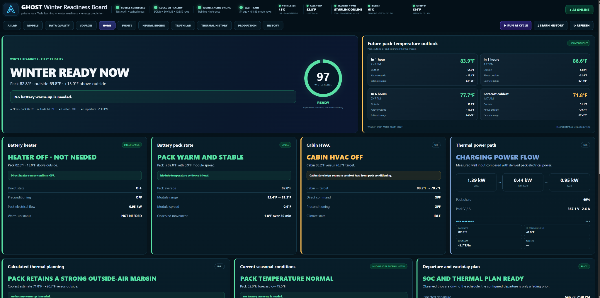
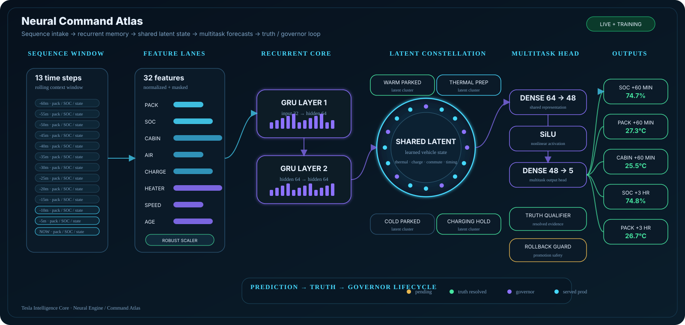
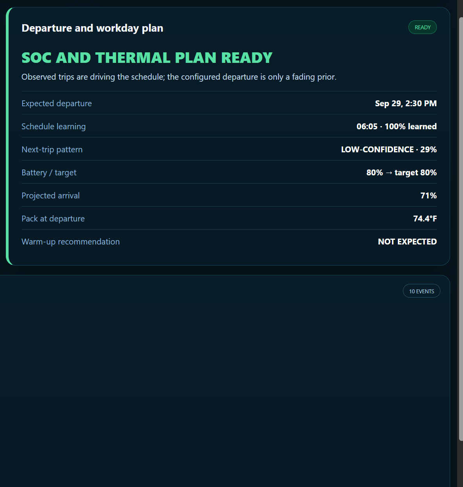
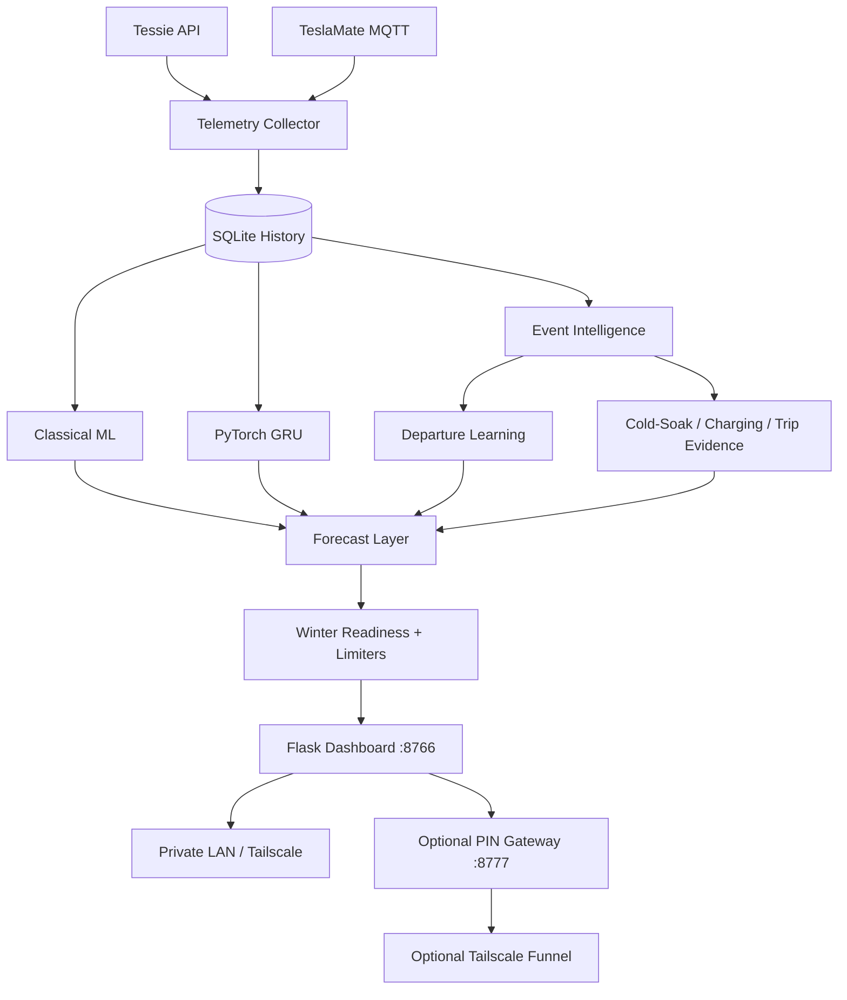

<div align="center">

# Tesla Intelligence Core

### Local-first predictive intelligence for your Tesla — running on your own Raspberry Pi.

**Thermal learning · charging behavior · trip-pattern learning · winter readiness · neural forecasting**

[](https://github.com/prokyle123/tesla-intelligence-core/releases)
[](https://github.com/prokyle123/tesla-intelligence-core/actions/workflows/smoke.yml)
[](LICENSE)


</div>

Tesla Intelligence Core is a self-hosted Tesla telemetry and learning system built around one practical question:

> **When I leave next, what condition will the car and battery actually be in?**

It watches live telemetry, builds a local history, learns recurring behavior, extracts trips/charging/thermal events, trains predictive models, and turns all of that into a dashboard that explains **what it expects and why**.

It started as a winter-readiness project and grew into a broader local vehicle-intelligence platform.

> [!IMPORTANT]
> **Read-only by design.** Tesla Intelligence Core observes telemetry and builds predictions. It does **not** send driving, climate, charging, locking, or other control commands to the vehicle.

<p align="center">
  <a href="docs/images/dashboard-overview.png">
    
  </a>
</p>
<p align="center"><sub><b>Main operations dashboard</b> — winter readiness, live thermal state, charging, learned departure context and forward pack-temperature outlook in one view.</sub></p>

---

## Visual tour

### 🧠 Live Neural Engine Atlas

This is the **actual Neural Engine dashboard from a running instance**, not a conceptual mock-up. Rolling sequence history feeds normalized feature lanes, two GRU layers build temporal memory, a shared latent state captures vehicle context, and a multitask head produces future SOC / pack / cabin forecasts. The same live view exposes Truth resolution, challenger/production comparison, governor state and rollback protection so the model lifecycle is visible instead of hidden.

<p align="center">
  <a href="docs/images/neural-command-atlas.svg">
    
  </a>
</p>

<table>
<tr>
<td width="50%" valign="top">

### 🌡️ Pack-temperature forecasting

Forecasts show the expected future pack temperature together with outside air, thermal margin and an estimate range — not just a single unexplained number.

<a href="docs/images/temperature-forecasting.jpg">
  
</a>

</td>
<td width="50%" valign="top">

### 🕒 Learned departure planning

The system learns repeated departure behavior from real drive history. A configured departure time is only a fading prior; observed behavior takes over as evidence builds.

<a href="docs/images/departure-learning.png">
  
</a>

</td>
</tr>
</table>

> **The important part is the connection between the views:** live telemetry becomes history, history becomes learned behavior, learned behavior becomes forecasts, and the readiness layer explains what those forecasts mean for the next trip.

> [!NOTE]
> The screenshots come from a real development instance, so live values will differ from car to car. Some UI screenshots still carry the project's original **GHOST** internal branding; the public project name is **Tesla Intelligence Core**.

---

## Why this project is different

Most Tesla dashboards show you **what is happening now**.

Tesla Intelligence Core is designed to learn enough history to answer what is likely to happen **next**:

| Live state | Learned context | Prediction |
|---|---|---|
| Battery / module temperatures | How your pack cools and warms | Pack temperature at departure |
| SOC / charging power | Your real charging rate | Departure SOC / charge deadline |
| Drive starts | Your recurring departure patterns | Next-trip probability |
| Past trips | Typical SOC use and commute behavior | Arrival SOC reserve |
| Outside air + weather | Cold-soak and thermal history | Winter readiness |
| Historical outcomes | Prediction vs reality | Truth / model audit |

The result is not just a graph dump. The main view produces a **Winter Readiness Score** and human-readable **Winter Readiness Limiters** that explain exactly what is reducing confidence/readiness.

---

## Highlights

### ❄️ Winter Readiness
- 0–100 readiness score
- Human-readable **Winter Readiness Limiters**
- Exact point deductions instead of a mystery score
- Live pack, module, ambient, charging and departure context
- Projected pack temperature at departure
- Projected departure and arrival SOC
- Warm-up / preconditioning context
- Cold-soak and thermal-retention learning

### 🧠 Learned departures
- Learns actual drive-start behavior from telemetry
- Optional configured departure is only a **fading prior**
- Repeated routine departures gain weight naturally
- Random / secondary trips remain useful without dragging the main routine around
- Separate **schedule confidence** and **next-trip probability**


### 🔋 Battery + charging intelligence
- Pack / module temperature tracking
- Pack current, voltage and power context where available
- Charge-rate and Level-1 behavior memory
- Charge deadline estimation
- Arrival reserve logic
- Thermal margin and pack trend
- Battery-heater / HVAC / preconditioning observation

### 📈 Prediction stack
- Scikit-learn baseline models
- PyTorch GRU temporal sequence model
- Challenger / shadow model workflow
- Promotion gates and rollback-oriented governor
- Prediction auditing / **Truth Lab**
- Model generations stored independently

### 🛰️ Telemetry + integrations
- **Tessie API**
- **TeslaMate MQTT**
- Tessie historical backfill
- Open-Meteo weather context
- Optional EcoFlow RIVER 3 telemetry
- Optional Starlink local power telemetry
- Optional Tailscale private access
- Optional PIN-protected Tailscale Funnel

### 🔒 Local-first
- SQLite history lives on your Pi
- Learned model artifacts stay on your Pi
- Credentials live outside the repository
- Public remote access is optional
- Raw dashboard and public PIN gateway use separate ports

---

# Quick start

## Recommended hardware

- **Raspberry Pi 5** recommended
- 64-bit Raspberry Pi OS or Debian
- Internet connection during install
- Python 3.11+
- One telemetry source:
  - **Tessie** account/API token, or
  - an existing **TeslaMate MQTT** broker

A Pi 4 or other 64-bit Debian-class machine may work, but the project is developed with Pi 5-class hardware in mind and neural training is the most CPU-intensive workload.

## One-command interactive install

```bash
bash <(curl -fsSL https://raw.githubusercontent.com/prokyle123/tesla-intelligence-core/main/install.sh)
```

The installer asks for what it needs as it goes:

1. Linux service user
2. Timezone
3. Tessie or TeslaMate
4. Tessie token / optional VIN, or MQTT connection details
5. Optional departure-time seed
6. Historical backfill window
7. Dashboard port
8. Optional EcoFlow integration
9. Optional Starlink support
10. Optional PIN-protected Tailscale Funnel

It then installs dependencies, creates the Python environment, builds the systemd services/timers, initializes the database, starts collection + dashboard services, and can begin historical learning immediately.

> [!TIP]
> For Tessie users, a historical backfill lets the system begin learning from prior driving/charging behavior instead of waiting weeks from a completely empty database.

Full walkthrough: **[Installation guide](docs/INSTALL.md)**

---

# What happens after install?

Open:

```text
http://PI_ADDRESS:8766
```

The system begins collecting telemetry and gradually fills in the parts that require evidence.

You should expect some cards to show **LEARNING**, **THIN**, or lower confidence early on. That is intentional. Tesla Intelligence Core is designed to expose when it does *not* yet have enough history rather than pretending every estimate is equally strong.

Useful commands:

```bash
# System / data status
ghost-ai status

# Run an intelligence cycle now
ghost-ai intelligence

# Dashboard logs
sudo journalctl -u ghost-tesla-ai-web.service -f

# Collector logs
sudo journalctl -u ghost-tesla-ai-collector.service -f

# Neural training logs
sudo journalctl -u ghost-tesla-ai-neural.service -f
```

> [!NOTE]
> The public project name is **Tesla Intelligence Core**. Internal package, CLI and service names still use the original `ghost_tesla_ai`, `ghost-ai`, and `ghost-tesla-ai-*` names for compatibility with existing installs.

---

# How it works



### Data flow in plain English

1. **Collect** normalized telemetry from Tessie or TeslaMate.
2. **Store** it in local SQLite history.
3. **Extract events** such as drives, charging windows and thermal evidence.
4. **Learn behavior** such as recurring departures and cold-soak patterns.
5. **Train models** for future SOC / temperature behavior.
6. **Compare predictions against truth** as later telemetry arrives.
7. **Build readiness** from live state + learned evidence + forecasts.
8. **Explain the result** in the dashboard.

Deep dive: **[Architecture](docs/ARCHITECTURE.md)**

---

# The dashboard

The main dashboard is intentionally operational rather than just analytical.

### Winter Readiness
The hero card answers whether the car appears ready for the next expected trip. If the score is not 100, the **Winter Readiness Limiters** show the actual reason and point hit.

Examples of limiter-style conditions include:
- pack forecast below target;
- low projected arrival reserve;
- insufficient departure charge;
- thin commute evidence;
- thin cold-soak history;
- low evidence confidence.

### Departure + workday plan
Shows the learned next-departure context, departure SOC, projected arrival SOC, expected pack temperature and preconditioning/warm-up context.

### Neural Engine
Shows prediction/model state separately from the readiness score. Readiness is an operational score; model metrics are model-performance evidence.

### Truth Lab / history
Provides the deeper validation side of the project: what the system predicted versus what later happened.

---

# Telemetry sources

## Tessie
Best fit when you want:
- live API telemetry;
- historical backfill;
- an easy way to seed learning on a new install.

The installer stores the Tessie token at:

```text
/etc/ghost-tesla-ai/tessie.token
```

## TeslaMate MQTT
Best fit when you already run TeslaMate and want Tesla Intelligence Core consuming the MQTT stream.

You provide:
- broker host;
- port;
- TeslaMate car ID;
- optional MQTT username/password;
- optional TLS.

See **[Configuration](docs/CONFIGURATION.md)** for details.

---

# Data, privacy and security

Vehicle telemetry can reveal extremely personal patterns: when you leave, where your routines occur, charging habits, and potentially location-related information contained in provider payloads.

Default storage:

```text
Code       /opt/ghost-tesla-ai
Config     /etc/ghost-tesla-ai/ghost.env
Tessie     /etc/ghost-tesla-ai/tessie.token
Database   /var/lib/ghost-tesla-ai/ghost_ai.sqlite3
Models     /var/lib/ghost-tesla-ai/models
```

The repository ignores runtime databases, environment files, tokens, trained artifacts and logs.

Read before exposing anything publicly:

- **[Privacy](PRIVACY.md)**
- **[Security](SECURITY.md)**
- **[Remote access](docs/REMOTE_ACCESS.md)**

### Remote access model

Private access:

```text
Your device -> Tailscale -> Pi:8766
```

Optional public path:

```text
Internet HTTPS
      ↓
Tailscale Funnel
      ↓
127.0.0.1:8777
      ↓
PIN gateway
      ↓
127.0.0.1:8766
```

Do **not** point a public Funnel directly at `8766` if you expect the PIN gateway to protect the dashboard.

---

# Updating

If you cloned the repository:

```bash
git pull
./update.sh
```

Runtime history, model artifacts and secrets live outside the code tree and are preserved by the installer/update path.

See **[Installation → Updating](docs/INSTALL.md#updating)**.

---

# Uninstalling

From the repository:

```bash
./uninstall.sh
```

The uninstaller asks before removing learned data, models and configuration.

---

# Project status

**Current public release: v0.8.27.6**

This is an experimental enthusiast project, not a Tesla product and not a safety system.

Predictions are estimates. Do not treat them as guarantees of:
- battery temperature;
- remaining range;
- charging completion;
- departure timing;
- vehicle operation.

Development/testing has primarily centered on **Model 3 telemetry**. The code is not intentionally locked to one Tesla model, but different vehicles/providers may expose different signals.

If you run it on another Tesla, a compatibility report is genuinely useful.

---

# Documentation

| Guide | What it covers |
|---|---|
| **[Install](docs/INSTALL.md)** | Full fresh-install walkthrough and validation |
| **[Configuration](docs/CONFIGURATION.md)** | Environment settings and data paths |
| **[Architecture](docs/ARCHITECTURE.md)** | Collector → learning → models → readiness |
| **[Remote access](docs/REMOTE_ACCESS.md)** | Tailscale and PIN-protected Funnel |
| **[Troubleshooting](docs/TROUBLESHOOTING.md)** | Services, logs, common install/runtime problems |
| **[FAQ](docs/FAQ.md)** | Common project questions |
| **[Compatibility](docs/COMPATIBILITY.md)** | What is known/tested and how to report results |
| **[Privacy](PRIVACY.md)** | Data-handling expectations |
| **[Security](SECURITY.md)** | Secrets and remote-exposure guidance |
| **[Contributing](CONTRIBUTING.md)** | Issues, PRs and safe telemetry sharing |
| **[Changelog](CHANGELOG.md)** | Release history |

---

# Contributing

Useful contributions include:
- field reports from other Tesla models;
- Tessie / TeslaMate normalization fixes;
- cold-climate thermal observations;
- Pi performance improvements;
- model/truth-audit improvements;
- dashboard usability work;
- synthetic/redacted test data.

Please **do not** post VINs, exact locations, tokens, raw private telemetry or credentials in public issues.

Start here: **[CONTRIBUTING.md](CONTRIBUTING.md)**

---

# License

MIT — see **[LICENSE](LICENSE)**.

---

<div align="center">

### Built for people who want to understand what their Tesla is doing — and what it is likely to do next.

**Tesla Intelligence Core is unofficial and is not affiliated with or endorsed by Tesla, Tessie, EcoFlow, Starlink, Tailscale, or Open-Meteo.**

Product and service names belong to their respective owners.

</div>
