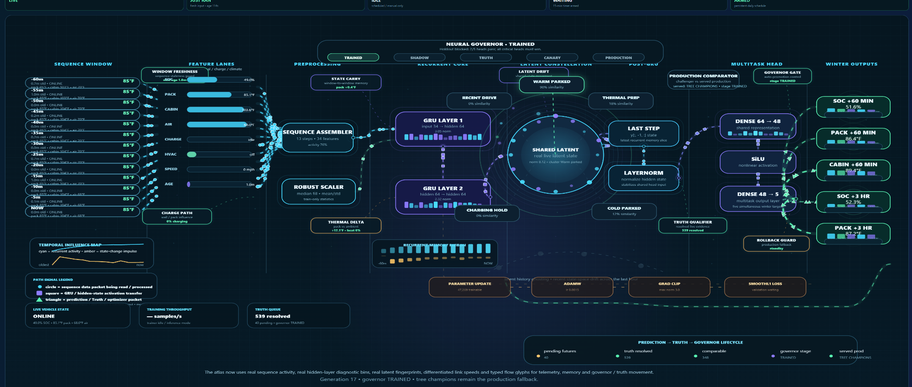
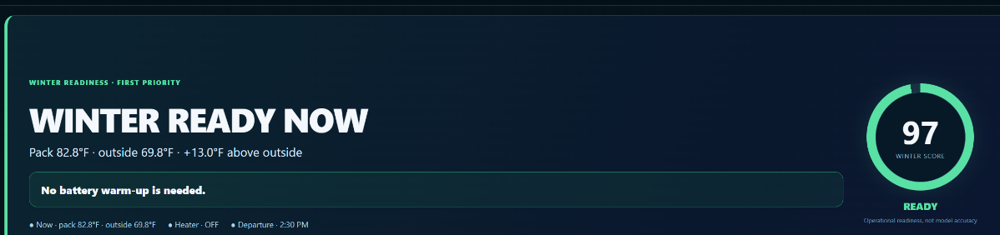
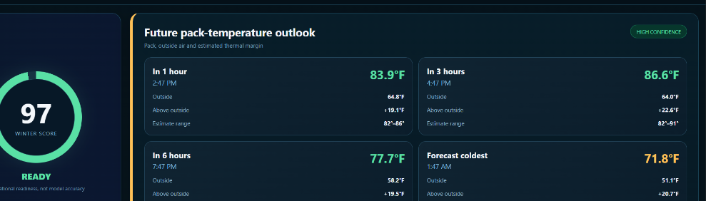
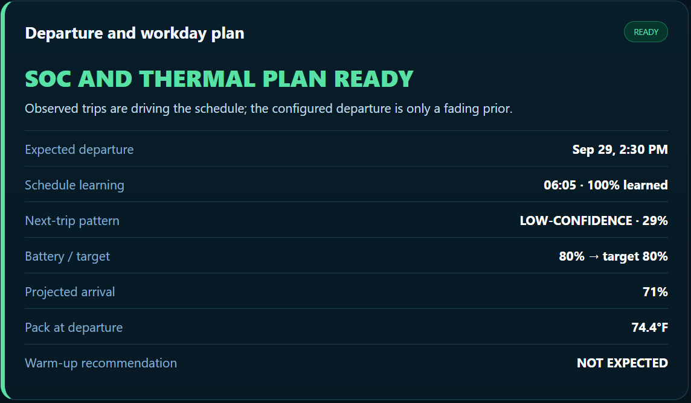
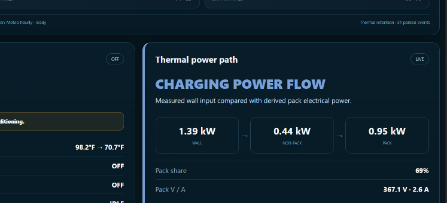
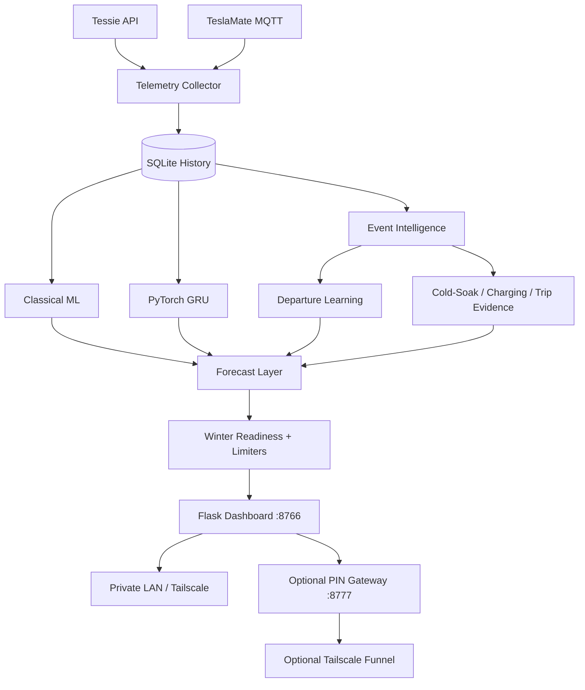

<div align="center">

# Tesla Intelligence Core

### A self-hosted Tesla learning system that predicts what happens next — not just what is happening now.

**Telemetry → local history → learned behavior → neural forecasting → truth validation → readiness**

**Built for cold-soaked batteries, slow home charging, long commutes, and people who want evidence instead of guesses.**

[](https://github.com/prokyle123/tesla-intelligence-core/releases)
[](https://github.com/prokyle123/tesla-intelligence-core/actions/workflows/smoke.yml)
[](LICENSE)


**Core stack**


**Built around real EV constraints**


**[Quick install](#quick-start) · [Visual tour](#visual-tour) · [Use cases](docs/USE_CASES.md) · [How it works](#how-it-works) · [Documentation](#documentation) · [Latest release](https://github.com/prokyle123/tesla-intelligence-core/releases/latest)**

⭐ **If this project is useful to you, star the repository.** It is the simplest way to help other Tesla / EV tinkerers discover it.

</div>

Tesla Intelligence Core is a **self-hosted Tesla battery analytics, predictive telemetry and machine-learning platform for Raspberry Pi** built around one practical question:

> **When I leave next, what condition will the car and battery actually be in?**

Because **80% SOC is not the whole answer**.

A car sitting at 80% on a mild afternoon is not the same situation as a car sitting at 80% after hours of cold soak before a long winter commute. If home charging is slow, every hour of available charging matters. If the drive is long, departure SOC is only half the story — the reserve expected at the other end matters too.

Tesla Intelligence Core watches live telemetry, builds a local history, learns recurring behavior, extracts trips/charging/thermal events, trains predictive models, and turns all of that into a dashboard that explains **what it expects, how confident it is, and why**.

It started as a winter-readiness project and grew into a broader local vehicle-intelligence platform.

> [!IMPORTANT]
> **Read-only by design.** Tesla Intelligence Core observes telemetry and builds predictions. It does **not** send driving, climate, charging, locking, or other control commands to the vehicle.

### Built for real-world EV constraints

Tesla Intelligence Core is especially useful when **time, temperature and charging speed all matter at once**.

| Situation | What the system adds |
|---|---|
| **❄️ Long winter commute** | Learns typical trip behavior, projects departure conditions and estimates **arrival SOC reserve** instead of stopping at the current battery percentage. |
| **🔌 Level 1 / slow home charging** | Learns the car's real charging behavior, tracks wall input and estimates whether the battery is on pace for the next departure. |
| **🥶 Outdoor / cold-soaked car** | Tracks pack and module temperatures, cold-soak evidence, thermal retention and future pack-temperature forecasts. |
| **🕒 Departure time changes** | Learns recurring drive starts from history and keeps **schedule confidence** separate from **next-trip confidence**, so a random trip does not have to redefine the routine. |
| **⚡ Charging + thermal load together** | Shows charging power alongside derived pack / non-pack power so it is easier to understand where limited input power is going. |
| **📉 Tight energy margin** | Combines departure SOC, projected trip use, expected arrival reserve and thermal context instead of relying on one live SOC number. |
| **🧠 You want evidence, not magic** | Exposes prediction ranges, Truth Lab results, model generations, challenger/production state and readiness limiters instead of hiding everything behind a generic “AI” score. |

#### The kind of questions it is built to answer

- **Will slow overnight charging actually get me where I want to be by departure?**
- **Will the pack still be cold when I leave?**
- **How much SOC am I likely to have after the drive, not just before it?**
- **Is today's thermal behavior normal for this car?**
- **Is the current forecast based on strong history or thin evidence?**
- **Did previous predictions turn out to be right?**
- **Is the model improving enough to replace the current production model?**

> **For people who depend on the car every day, the useful question is not “what does the telemetry say right now?” It is “what is this car likely to look like when I actually need it?”**

<p align="center">
  <a href="docs/images/dashboard-overview.png">
    
  </a>
</p>
<p align="center"><sub><b>Main operations dashboard</b> — winter readiness, live thermal state, charging, learned departure context and forward pack-temperature outlook in one view.</sub></p>

---

## Visual tour

### 🧠 Live Neural Engine Atlas

This is the **actual Neural Engine dashboard from a running instance**, not a conceptual mock-up. The live atlas exposes the full prediction path: rolling sequence history, normalized feature lanes, preprocessing, two GRU layers, recurrent memory, shared latent state, multitask outputs, Truth qualification, challenger/production comparison, governor state, and rollback protection.

<p align="center">
  <a href="docs/images/neural-engine-atlas.png">
    
  </a>
</p>

<table>
<tr>
<td width="50%" valign="top">

### ❄️ Winter readiness

The main readiness feature combines live pack temperature, outside air, departure context and an explainable readiness score. The score is operational guidance — not model accuracy.

<a href="docs/images/winter-readiness-feature.png">
  
</a>

</td>
<td width="50%" valign="top">

### 🌡️ Pack-temperature forecasting

Hour-ahead and multi-hour forecasts show expected pack temperature, outside air, thermal margin and estimate ranges — not just a single unexplained prediction.

<a href="docs/images/temperature-forecast-feature.png">
  
</a>

</td>
</tr>
<tr>
<td width="50%" valign="top">

### 🕒 Learned departure planning

Observed drive history learns recurring departure behavior. A configured departure time is only a fading prior, while the dashboard separately exposes learned schedule confidence and next-trip confidence.

<a href="docs/images/departure-planning-feature.png">
  
</a>

</td>
<td width="50%" valign="top">

### ⚡ Thermal power path

The thermal power-path view compares wall input with derived non-pack and pack electrical power so charging and thermal behavior can be interpreted together.

<a href="docs/images/thermal-power-path-feature.png">
  
</a>

</td>
</tr>
</table>

> **The important part is the connection between the views:** live telemetry becomes history, history becomes learned behavior, learned behavior becomes forecasts, and the readiness layer explains what those forecasts mean for the next trip.

> [!NOTE]
> These images come from a real development instance, so live values will differ from car to car. Some UI screens still carry the project's original **GHOST** internal branding; the public project name is **Tesla Intelligence Core**.

---

## Android companion + in-car browser

Tesla Intelligence Core is not limited to a desktop browser.

### 📱 Android companion

The Android companion keeps the Pi dashboard as the source of truth while adding phone-focused discovery, failover, diagnostics, navigation and background alerts.

**Companion v0.9.1** uses one navigation surface only: a single horizontally swipeable dashboard-owned row.

```text
HOME · READY · EVENTS · NEURAL · TRUTH · THERMAL · MORE
```

The old duplicate Android navigation bar has been removed. The WebView is now explicitly padded for the real Android status/cutout and navigation/gesture insets so the companion bar stays above the phone's Home/Back/Recents area.

The Connection Center supports:

```text
Local LAN
    ↓ fallback
Private Tailscale
    ↓ fallback
Public HTTPS / PIN gateway
```

Configured routes are tested in parallel and the companion verifies the real dashboard API instead of treating any HTTP 200 page as data.

#### Background monitoring + notifications

v0.9.1 adds an Android JobService background monitor. Android wakes it approximately every 15 minutes when networking and OS scheduling allow, it checks the saved Tesla Intelligence Core routes, and then it goes back to sleep.

The Notification Center can independently enable:

- connection lost / restored;
- Winter Readiness threshold alerts;
- warm-up / preconditioning recommendations;
- projected arrival SOC threshold alerts;
- battery-heater activation.

The default readiness threshold is 70 and the default projected-arrival threshold is 20%. Both are editable in the app. A manual **Run Background Check Now** action and a test notification are included.

Background scheduling persists across reboot/package replacement and does not require an always-running foreground process.

**[Download Android Companion v0.9.1](https://github.com/prokyle123/tesla-intelligence-core/releases/download/v0.8.27.6/Tesla-Intelligence-Core-Companion-v0.9.1-debug.apk)** · **[Source + local installer](companion/android)**

> [!NOTE]
> The public companion APK is debug-signed. An older locally built copy may have a different Android signature. Rebuilding on the same PC normally reuses that PC's Android debug key and allows an in-place update without clearing the saved endpoints.

### 🚗 Open the dashboard in the Tesla browser

On the setup this project was developed with, the Tesla browser would not load the Pi's local/private dashboard address. A working route was:

```text
Tesla browser
      ↓  Internet HTTPS
Tailscale Funnel
      ↓
PIN gateway
      ↓
Tesla Intelligence Core
```

This is useful because the Tesla browser does not need direct access to the Pi's LAN address. If the Pi installation has working Internet access, Funnel is configured correctly, and the car has Internet access, the dashboard can be reached directly from the Tesla browser using the public HTTPS URL.

**Why the PIN?** Funnel makes that HTTPS endpoint reachable from the public Internet. The intended setup is **Funnel → PIN gateway → dashboard**, not Funnel directly to the raw dashboard.

Vehicle software, networks and installations can vary; this documents the project's tested setup rather than assuming every Tesla behaves identically.

**[Full Tesla browser + Funnel guide](docs/TESLA_BROWSER.md)**

---

## Why this project is different

### Most dashboards stop at telemetry. Tesla Intelligence Core keeps going.

A telemetry-only dashboard can tell you the battery is **82°F and 80% right now**.

Tesla Intelligence Core asks the harder questions:

> **What will that temperature be in three hours? What SOC will actually be available at departure? What will probably remain after the drive? Is this a routine departure or a random trip? How much evidence supports the answer? And when the future arrives, was the prediction right?**

It is built to turn a live snapshot into a continuously improving model of **your particular car, your charging setup, your routine, and what is likely to happen next**.

| | |
|---|---|
| **🧠 Learns your car** | Builds evidence about pack cooling, thermal retention, cold soak, charging behavior, trip energy use and other behavior from your own history instead of relying only on fixed assumptions. |
| **🕒 Learns your routine** | Finds repeated departure patterns from actual drive starts. A configured departure is only a fading prior, while random and secondary trips remain useful without taking over the routine. |
| **🔮 Forecasts multiple futures** | The neural engine consumes rolling telemetry sequences and produces multi-horizon outputs for **SOC, pack temperature and cabin temperature** rather than a single one-off estimate. |
| **🎯 Checks prediction against reality** | **Truth Lab** resolves old predictions when future telemetry arrives, so the system can measure what actually happened instead of displaying a forecast and forgetting it. |
| **🛡️ Governs its own models** | Challenger and production generations can be compared before promotion. The governor, promotion gates and rollback path are visible in the Neural Engine instead of being hidden behind an opaque “AI” label. |
| **❄️ Turns models into an answer you can use** | Winter Readiness combines live conditions, learned evidence and forecasts into a score with **human-readable limiters** showing exactly what is costing points. |
| **🔒 Local-first and read-only** | History, events and trained model artifacts live on your Pi. The project observes and predicts; it does not intentionally send driving, locking, charging or climate-control commands to the vehicle. |
| **🔌 More than one telemetry path** | Supports **Tessie API** and **TeslaMate MQTT**, with optional weather, EcoFlow, Starlink and Tailscale integrations around the core intelligence stack. |

### From raw telemetry to a closed learning loop

```text
Tesla telemetry
      ↓
Local SQLite history
      ↓
Trips · charging · thermal events · departure patterns
      ↓
Classical ML + PyTorch GRU sequence model
      ↓
Future SOC · pack temperature · cabin temperature
      ↓
Truth Lab: prediction → actual outcome
      ↓
Governor: challenger → promotion / hold / rollback
      ↓
Winter Readiness + human-readable limiters
```

### A telemetry view vs. Tesla Intelligence Core

| Telemetry-only view | Tesla Intelligence Core |
|---|---|
| Current SOC | **Projected departure SOC + projected arrival reserve** |
| Current pack temperature | **1h / 3h / multi-hour pack-temperature forecasts** |
| Drive history | **Learned recurring departure behavior** |
| Charging power | **Learned charging behavior + charge-deadline context** |
| Weather / outside temperature | **Cold-soak and thermal-margin evidence** |
| One model output | **Serving + challenger generations with promotion gates** |
| Prediction shown once | **Prediction later resolved against truth** |
| Generic status | **Explainable Winter Readiness with exact limiters** |

> **The goal is not to put an “AI” badge on a Tesla dashboard. The goal is to build a local system that learns, predicts, checks itself against reality, and gets more useful as it observes the car.**

---

## Highlights

### ❄️ Winter Readiness
- 0–100 readiness score
- Human-readable **Winter Readiness Limiters**
- Exact point deductions instead of a mystery score
- Live pack, module, ambient, charging and departure context
- Projected pack temperature at departure
- Projected departure and arrival SOC
- Warm-up / preconditioning context
- Cold-soak and thermal-retention learning

### 🧠 Learned departures
- Learns actual drive-start behavior from telemetry
- Optional configured departure is only a **fading prior**
- Repeated routine departures gain weight naturally
- Random / secondary trips remain useful without dragging the main routine around
- Separate **schedule confidence** and **next-trip probability**


### 🔋 Battery + charging intelligence
- Pack / module temperature tracking
- Pack current, voltage and power context where available
- Charge-rate and **Level 1 behavior memory**
- Charging pace / deadline context for the next departure
- Projected departure SOC and **arrival reserve**
- Thermal margin and pack trend
- Battery-heater / HVAC / preconditioning observation
- Wall-input vs pack / non-pack power context where available

### 📈 Prediction stack
- Scikit-learn baseline models
- PyTorch GRU temporal sequence model
- Challenger / shadow model workflow
- Promotion gates and rollback-oriented governor
- Prediction auditing / **Truth Lab**
- Model generations stored independently

### 🛰️ Telemetry + integrations
- **Tessie API**
- **TeslaMate MQTT**
- Tessie historical backfill
- Open-Meteo weather context
- Optional EcoFlow RIVER 3 telemetry
- Optional Starlink local power telemetry
- Optional Tailscale private access
- Optional PIN-protected Tailscale Funnel

### 🔒 Local-first
- SQLite history lives on your Pi
- Learned model artifacts stay on your Pi
- Credentials live outside the repository
- Public remote access is optional
- Raw dashboard and public PIN gateway use separate ports

---

# Quick start

## Recommended hardware

- **Raspberry Pi 5** recommended
- 64-bit Raspberry Pi OS or Debian
- Internet connection during install
- Python 3.11+
- One telemetry source:
  - **Tessie** account/API token, or
  - an existing **TeslaMate MQTT** broker

A Pi 4 or other 64-bit Debian-class machine may work, but the project is developed with Pi 5-class hardware in mind and neural training is the most CPU-intensive workload.

## One-command interactive install

```bash
bash <(curl -fsSL https://raw.githubusercontent.com/prokyle123/tesla-intelligence-core/main/install.sh)
```

The installer asks for what it needs as it goes:

1. Linux service user
2. Timezone
3. Tessie or TeslaMate
4. Tessie token / optional VIN, or MQTT connection details
5. Optional departure-time seed
6. Historical backfill window
7. Dashboard port
8. Optional EcoFlow integration
9. Optional Starlink support
10. Optional PIN-protected Tailscale Funnel

It then installs dependencies, creates the Python environment, builds the systemd services/timers, initializes the database, starts collection + dashboard services, and can begin historical learning immediately.

> [!TIP]
> For Tessie users, a historical backfill lets the system begin learning from prior driving/charging behavior instead of waiting weeks from a completely empty database.

Full walkthrough: **[Installation guide](docs/INSTALL.md)**

---

# What happens after install?

Open:

```text
http://PI_ADDRESS:8766
```

The system begins collecting telemetry and gradually fills in the parts that require evidence.

You should expect some cards to show **LEARNING**, **THIN**, or lower confidence early on. That is intentional. Tesla Intelligence Core is designed to expose when it does *not* yet have enough history rather than pretending every estimate is equally strong.

Useful commands:

```bash
# System / data status
ghost-ai status

# Run an intelligence cycle now
ghost-ai intelligence

# Dashboard logs
sudo journalctl -u ghost-tesla-ai-web.service -f

# Collector logs
sudo journalctl -u ghost-tesla-ai-collector.service -f

# Neural training logs
sudo journalctl -u ghost-tesla-ai-neural.service -f
```

> [!NOTE]
> The public project name is **Tesla Intelligence Core**. Internal package, CLI and service names still use the original `ghost_tesla_ai`, `ghost-ai`, and `ghost-tesla-ai-*` names for compatibility with existing installs.

---

# How it works



### Data flow in plain English

1. **Collect** normalized telemetry from Tessie or TeslaMate.
2. **Store** it in local SQLite history.
3. **Extract events** such as drives, charging windows and thermal evidence.
4. **Learn behavior** such as recurring departures and cold-soak patterns.
5. **Train models** for future SOC / temperature behavior.
6. **Compare predictions against truth** as later telemetry arrives.
7. **Build readiness** from live state + learned evidence + forecasts.
8. **Explain the result** in the dashboard.

Deep dive: **[Architecture](docs/ARCHITECTURE.md)**

---

# The dashboard

The main dashboard is intentionally operational rather than just analytical.

### Winter Readiness
The hero card answers whether the car appears ready for the next expected trip. If the score is not 100, the **Winter Readiness Limiters** show the actual reason and point hit.

Examples of limiter-style conditions include:
- pack forecast below target;
- low projected arrival reserve;
- insufficient departure charge;
- thin commute evidence;
- thin cold-soak history;
- low evidence confidence.

### Departure + workday plan
Shows the learned next-departure context, departure SOC, projected arrival SOC, expected pack temperature and preconditioning/warm-up context.

### Neural Engine
Shows prediction/model state separately from the readiness score. Readiness is an operational score; model metrics are model-performance evidence.

### Truth Lab / history
Provides the deeper validation side of the project: what the system predicted versus what later happened.

---

# Telemetry sources

## Tessie
Best fit when you want:
- live API telemetry;
- historical backfill;
- an easy way to seed learning on a new install.

The installer stores the Tessie token at:

```text
/etc/ghost-tesla-ai/tessie.token
```

## TeslaMate MQTT
Best fit when you already run TeslaMate and want Tesla Intelligence Core consuming the MQTT stream.

You provide:
- broker host;
- port;
- TeslaMate car ID;
- optional MQTT username/password;
- optional TLS.

See **[Configuration](docs/CONFIGURATION.md)** for details.

---

# Data, privacy and security

Vehicle telemetry can reveal extremely personal patterns: when you leave, where your routines occur, charging habits, and potentially location-related information contained in provider payloads.

Default storage:

```text
Code       /opt/ghost-tesla-ai
Config     /etc/ghost-tesla-ai/ghost.env
Tessie     /etc/ghost-tesla-ai/tessie.token
Database   /var/lib/ghost-tesla-ai/ghost_ai.sqlite3
Models     /var/lib/ghost-tesla-ai/models
```

The repository ignores runtime databases, environment files, tokens, trained artifacts and logs.

Read before exposing anything publicly:

- **[Privacy](PRIVACY.md)**
- **[Security](SECURITY.md)**
- **[Remote access](docs/REMOTE_ACCESS.md)**

### Remote access model

Private access:

```text
Your device -> Tailscale -> Pi:8766
```

Optional public path:

```text
Internet HTTPS
      ↓
Tailscale Funnel
      ↓
127.0.0.1:8777
      ↓
PIN gateway
      ↓
127.0.0.1:8766
```

Do **not** point a public Funnel directly at `8766` if you expect the PIN gateway to protect the dashboard.

---

# Updating

If you cloned the repository:

```bash
git pull
./update.sh
```

Runtime history, model artifacts and secrets live outside the code tree and are preserved by the installer/update path.

See **[Installation → Updating](docs/INSTALL.md#updating)**.

---

# Uninstalling

From the repository:

```bash
./uninstall.sh
```

The uninstaller asks before removing learned data, models and configuration.

---

# Project status

**Current public release: v0.8.27.6**

This is an experimental enthusiast project, not a Tesla product and not a safety system.

Predictions are estimates. Do not treat them as guarantees of:
- battery temperature;
- remaining range;
- charging completion;
- departure timing;
- vehicle operation.

Development/testing has primarily centered on **Model 3 telemetry**. The code is not intentionally locked to one Tesla model, but different vehicles/providers may expose different signals.

If you run it on another Tesla, a compatibility report is genuinely useful.

---

# Documentation

| Guide | What it covers |
|---|---|
| **[Use cases](docs/USE_CASES.md)** | Winter commuting, Level 1 charging, cold soak and other real-world scenarios |
| **[Feature matrix](docs/FEATURE_MATRIX.md)** | What each feature uses and what question it answers |
| **[Install](docs/INSTALL.md)** | Full fresh-install walkthrough and validation |
| **[Configuration](docs/CONFIGURATION.md)** | Environment settings and data paths |
| **[Architecture](docs/ARCHITECTURE.md)** | Collector → learning → models → readiness |
| **[Remote access](docs/REMOTE_ACCESS.md)** | Tailscale and PIN-protected Funnel |
| **[Tesla browser](docs/TESLA_BROWSER.md)** | In-car browser access through the optional HTTPS Funnel + PIN gateway |
| **[Android companion](companion/android/README.md)** | Mobile app, endpoint failover, current views and local build instructions |
| **[Troubleshooting](docs/TROUBLESHOOTING.md)** | Services, logs, common install/runtime problems |
| **[FAQ](docs/FAQ.md)** | Common project questions |
| **[Compatibility](docs/COMPATIBILITY.md)** | What is known/tested and how to report results |
| **[Roadmap](ROADMAP.md)** | Current development directions and community priorities |
| **[Support](SUPPORT.md)** | What to include when asking for help |
| **[Privacy](PRIVACY.md)** | Data-handling expectations |
| **[Security](SECURITY.md)** | Secrets and remote-exposure guidance |
| **[Contributing](CONTRIBUTING.md)** | Issues, PRs and safe telemetry sharing |
| **[Code of Conduct](CODE_OF_CONDUCT.md)** | Community participation expectations |
| **[Citation](CITATION.cff)** | Citation metadata for research / derived work |
| **[Changelog](CHANGELOG.md)** | Release history |

---

# Contributing

Useful contributions include:
- field reports from other Tesla models;
- Tessie / TeslaMate normalization fixes;
- cold-climate thermal observations;
- Pi performance improvements;
- model/truth-audit improvements;
- dashboard usability work;
- synthetic/redacted test data.

Please **do not** post VINs, exact locations, tokens, raw private telemetry or credentials in public issues.

Start here: **[CONTRIBUTING.md](CONTRIBUTING.md)**

Running Tesla Intelligence Core on a different Tesla model? **[Open a vehicle compatibility report](https://github.com/prokyle123/tesla-intelligence-core/issues/new?template=compatibility.yml)** — even a partial compatibility report helps map which telemetry signals are available across the fleet.

### Help the project get found

GitHub discovery is driven less by hashtags and more by **repository Topics, stars, forks, useful releases, links, README search terms and community activity**.

If Tesla Intelligence Core solves a real problem for you:

- ⭐ **Star it** so other Tesla / EV owners are more likely to find it.
- 🧪 Submit a **compatibility report** for your vehicle.
- 🐛 Open a reproducible issue when something breaks.
- 🔀 Send a pull request if you improve normalization, models, docs or the dashboard.
- 🔗 Share the repository with people working on TeslaMate, Tessie, Raspberry Pi, EV charging or cold-weather telemetry.

---

# License

MIT — see **[LICENSE](LICENSE)**.

---

<div align="center">

### Built for people who need more than a battery percentage — and want to know what their Tesla is likely to do next.

**Tesla Intelligence Core is unofficial and is not affiliated with or endorsed by Tesla, Tessie, EcoFlow, Starlink, Tailscale, or Open-Meteo.**

Product and service names belong to their respective owners.

</div>
