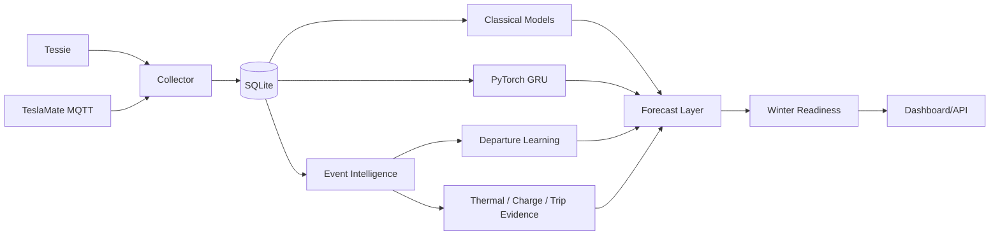

# Architecture

Tesla Intelligence Core is split into independent pieces so live collection/dashboard work is not blocked by heavier learning jobs.

The public project name is **Tesla Intelligence Core**. Internal package and service identifiers retain the original `ghost` naming for compatibility.

## High-level flow



## Collector

`ghost-tesla-ai-collector.service`

Responsibilities:
- read the configured source;
- normalize telemetry;
- avoid obvious duplicate cached Tessie samples;
- write telemetry into SQLite.

Supported source paths in the public installer:
- Tessie API;
- TeslaMate MQTT.

## SQLite history

Default:

```text
/var/lib/ghost-tesla-ai/ghost_ai.sqlite3
```

The database is the persistent local history used by downstream event extraction and learning.

## Event intelligence

`ghost-tesla-ai-intelligence.timer`

A scheduled intelligence cycle extracts higher-level evidence from raw telemetry, including drive/charging/thermal context.

The point of the event layer is to reason about meaningful periods instead of treating every sample as an isolated row.

## Departure learning

Departure timing is learned from observed drive starts.

A configured `EXPECTED_DEPARTURE` is a fading prior, not a permanent override.

The learner is designed to:
- recognize repeated routine timing;
- retain secondary/random trips as useful evidence;
- avoid letting occasional ad-hoc drives dominate the recurring commute pattern;
- expose both schedule confidence and next-trip probability.

## Classical models

Scikit-learn models provide baseline prediction paths for supported targets.

Model generations are stored independently rather than blindly replacing prior artifacts.

## Neural engine

The PyTorch GRU learns temporal behavior from sequences.

The neural path is separated from live serving work so training can be CPU-intensive without making the dashboard unusable.

The broader workflow includes:
- current serving generation;
- challenger/shadow generation;
- audit/truth evidence;
- promotion logic;
- rollback-oriented governor state.

## Prediction audit / Truth Lab

Predictions are only useful if they are compared with later observations.

The audit layer records enough context to evaluate model behavior against later truth data rather than only displaying a forecast and forgetting it.

## Winter readiness

Winter Readiness is an operational interpretation layer.

It combines:
- current vehicle state;
- learned schedule context;
- projected SOC;
- projected pack thermal state;
- evidence quality;
- learned trip/thermal behavior.

The readiness score is **not the same thing as model accuracy**.

If readiness is below 100, the dashboard exposes **Winter Readiness Limiters** rather than hiding the deduction.

## Dashboard/API

`ghost-tesla-ai-web.service`

Default:

```text
0.0.0.0:8766
```

Flask serves the dashboard and APIs.

## Remote access

Private access can use LAN or Tailscale directly on `8766`.

Optional public access is intentionally separated:

```text
Tailscale Funnel
  -> 127.0.0.1:8777
  -> PIN gateway
  -> 127.0.0.1:8766
```

The PIN gateway is not a replacement for a full enterprise identity layer, but it prevents the intended Funnel setup from exposing the raw dashboard directly.

## Runtime separation

Code:

```text
/opt/ghost-tesla-ai
```

Config/secrets:

```text
/etc/ghost-tesla-ai
```

History/models:

```text
/var/lib/ghost-tesla-ai
```

Keeping runtime state outside the repository/code directory lets normal updates replace application code without intentionally deleting learned state.
